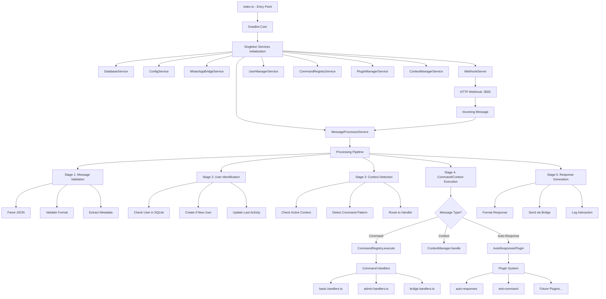
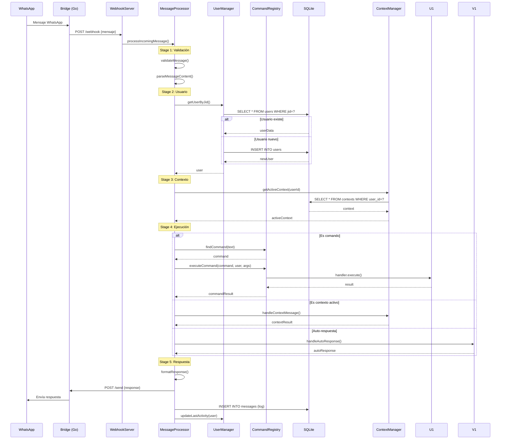
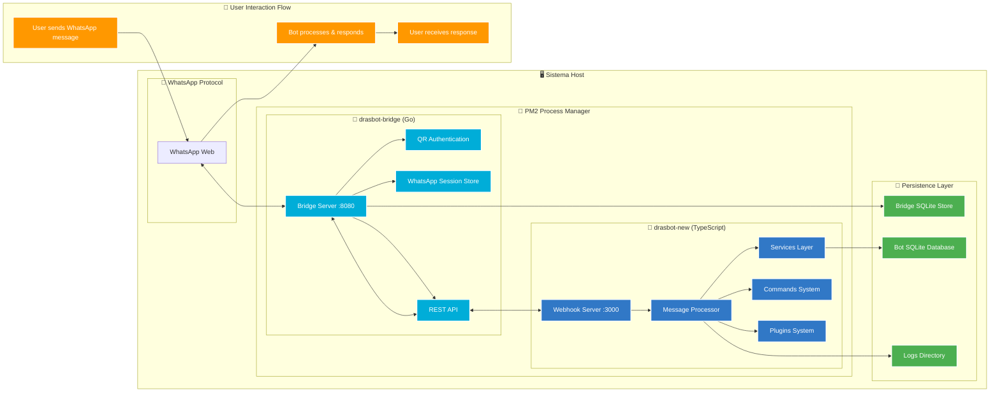

# 🤖 DrasBot - Sistema WhatsApp Moderno PM2


## 📋 Descripción General

**DrasBot v2.0** es un sistema WhatsApp chatbot moderno con arquitectura PM2, completamente refactorizado en TypeScript con persistencia real SQLite. Eliminando el sistema legacy tmux, ahora opera exclusivamente con PM2 para una gestión profesional de procesos.

### 🏗️ Arquitectura Actual (Junio 2025)

```
┌─────────────────────────────────────────────────────────────┐
│                🤖 DrasBot v2.0 - PM2 Architecture           │
├─────────────────────────────────────────────────────────────┤
│                                                             │
│  ┌─────────────────┐         ┌─────────────────────────┐   │
│  │  drasbot-bridge │◄──────►│     drasbot-new         │   │
│  │     (Go)        │   API   │   (TypeScript/Node.js)  │   │
│  │                 │  REST   │                         │   │
│  │  • PM2 ID: 0    │         │  • PM2 ID: 1            │   │
│  │  • Port: 8080   │         │  • Port: 3000           │   │
│  │  • Go 1.21+     │         │  • TypeScript 5.0+      │   │
│  │  • whatsmeow    │         │  • Arquitectura modular │   │
│  │  • SQLite store │         │  • SQLite persistencia  │   │
│  └─────────────────┘         └─────────────────────────┘   │
│           │                            │                    │
│           │                            │                    │
│      ┌─────▼────────┐              ┌───▼─────────────┐     │
│      │   WhatsApp   │              │ Sistema Comandos │     │
│      │   Protocol   │              │ + Usuarios Real  │     │
│      └──────────────┘              └─────────────────┘     │
└─────────────────────────────────────────────────────────────┘
```

## 🚀 Componentes del Sistema

### 1. 🌉 drasbot-bridge (Go) - PM2 ID: 0
**Ubicación**: `/whatsapp-bridge/`

Servidor de conexión WhatsApp que maneja el protocolo de comunicación.

#### Características:
- **Lenguaje**: Go 1.21+
- **Puerto**: 8080 (localhost only)
- **Gestión**: PM2 directo
- **Reinicio**: Inmediato (sin compilación)
- **API**: REST para comunicación con drasbot-new

#### Funcionalidades:
- Conexión directa WhatsApp Web
- Autenticación QR automática
- Envío/recepción mensajes
- Gestión de medios
- Persistencia de sesiones

### 2. 🤖 drasbot-new (TypeScript) - PM2 ID: 1
**Ubicación**: `/drasbot-new/`

Sistema principal de procesamiento con arquitectura moderna TypeScript.

#### Características:
- **Lenguaje**: TypeScript 5.0+ / Node.js 18+
- **Puerto**: 3000 (webhook localhost)
- **Gestión**: PM2 con compilación automática
- **Base de datos**: SQLite con persistencia real
- **Arquitectura**: Modular, orientada a servicios

#### Servicios Principales:
- **MessageProcessor**: Procesamiento inteligente de mensajes
- **UserManager**: Gestión real de usuarios en SQLite
- **CommandRegistry**: Sistema dinámico de comandos
- **ConfigService**: Configuración centralizada hot-reload
- **LoggerService**: Sistema de logs multi-nivel

#### Estructura del Proyecto:
```
drasbot-new/
├── src/
│   ├── services/          # Servicios principales
│   │   ├── message-processor.service.ts
│   │   ├── user-manager.service.ts
│   │   ├── command-registry.service.ts
│   │   └── config.service.ts
│   ├── commands/          # Sistema de comandos
│   │   ├── basic.handlers.ts
│   │   ├── admin.handlers.ts
│   │   └── user.handlers.ts
│   ├── database/          # Capa de datos SQLite
│   ├── types/            # Definiciones TypeScript
│   └── utils/            # Utilidades compartidas
├── dist/                 # Código compilado
├── data/                 # Base de datos SQLite
├── logs/                 # Logs del sistema
└── config/              # Configuraciones
```

## 🗄️ Base de Datos y Persistencia

### 📊 SQLite - Persistencia Real Verificada

**Archivo**: `drasbot-new/data/drasbot.db`

#### Características de Persistencia:
- ✅ **Usuarios persisten tras reinicio**: Los usuarios registrados se mantienen
- ✅ **Reconocimiento automático**: El bot reconoce usuarios existentes  
- ✅ **Estadísticas reales**: Contadores y métricas persistentes
- ✅ **Configuración dinámica**: Cambios se guardan automáticamente

#### Esquema de Base de Datos:
```sql
-- Tabla: users (persistencia real)
users {
  id: INTEGER PRIMARY KEY
  whatsapp_jid: TEXT UNIQUE
  phone_number: TEXT
  display_name: TEXT
  user_level: TEXT DEFAULT 'user'  -- 'banned'|'user'|'moderator'|'admin'|'owner'
  status: TEXT DEFAULT 'active'
  created_at: DATETIME
  updated_at: DATETIME
}

-- Tabla: system_stats (métricas reales)
system_stats {
  id: INTEGER PRIMARY KEY
  metric_name: TEXT
  metric_value: TEXT
  updated_at: DATETIME
}
```

### 🔧 Bridge Database (whatsapp-bridge)
- **Sesiones WhatsApp**: Claves de cifrado y autenticación
- **Store de mensajes**: Historial y metadatos
- **Gestión de dispositivos**: Información de conexión

## 🛠️ Gestión del Sistema

### 📜 Script Principal: `./manage-new.sh`

**⚠️ IMPORTANTE**: Usar SIEMPRE `./manage-new.sh` (NO `manage.sh` que está obsoleto)

#### Comandos Principales:
```bash
# 🚀 Gestión Básica
./manage-new.sh start           # Iniciar todo el ecosistema
./manage-new.sh stop            # Detener todos los procesos
./manage-new.sh restart         # Reiniciar con compilación automática
./manage-new.sh status          # Estado completo del sistema

# 🔍 Monitoreo y Diagnóstico  
./manage-new.sh health          # Health check completo
./manage-new.sh logs [service]  # Logs en tiempo real
./manage-new.sh monitor         # Monitor avanzado PM2

# 🔧 Gestión Individual
./manage-new.sh dev             # Solo drasbot-new (desarrollo)
./manage-new.sh bridge-restart  # Solo bridge
./manage-new.sh compile         # Solo compilar TypeScript

# 🧹 Mantenimiento
./manage-new.sh clean           # Limpiar procesos colgados
./manage-new.sh reset           # Reset completo del sistema
```

#### Funcionalidades Automáticas:
- ✅ **Compilación automática** de TypeScript antes de reiniciar
- ✅ **Cierre de tmux obsoletos** automáticamente
- ✅ **Health checks** después de cada operación
- ✅ **Gestión de errores** con rollback automático
- ✅ **Logs en tiempo real** con colores y timestamps

### 🔧 Gestión con PM2

```bash
# Estado de procesos
pm2 status

# Logs individuales
pm2 logs drasbot-new
pm2 logs drasbot-bridge

# Reinicio manual
pm2 restart drasbot-new
pm2 restart drasbot-bridge

# Monitor avanzado
pm2 monit

# Información detallada
pm2 show drasbot-new
```

## 📦 Instalación

### 🎯 Instalación Rápida (Recomendada)

```bash
# Clonar el repositorio
git clone https://github.com/DanielMartinezSebastian/dras-whatsapp-bot.git drasBot
cd drasBot

# Instalación automática de dependencias
./install-deps.sh

# Iniciar el sistema
./manage-new.sh start

# Verificar estado
./manage-new.sh health
```

### 🔧 Instalación Manual

#### Dependencias del Sistema:
```bash
# Manjaro/Arch Linux
sudo pacman -S nodejs npm go pm2

# Ubuntu/Debian
sudo apt update && sudo apt install -y nodejs npm golang
sudo npm install -g pm2

# Verificar versiones
node --version    # >= 18.0.0
go version       # >= 1.21
pm2 --version    # >= 5.0.0
```

#### Dependencias del Proyecto:
```bash
# Dependencias drasbot-new
cd drasbot-new
npm install
npm run build

# Dependencias bridge
cd ../whatsapp-bridge
go mod tidy
go mod download
```

## 🚀 Uso y Operación

### 📱 Comandos Disponibles

#### Comandos Básicos (Todos los usuarios):
- `/help` - Ayuda personalizada por tipo de usuario
- `/info` - Información del sistema y versión
- `/ping` - Verificar latencia y conectividad
- `/status` - Estado actual del bot

#### Comandos de Usuario:
- `/profile` - Ver perfil personal y estadísticas
- `/usertype` - Ver tipo de usuario actual

#### Comandos Administrativos (Solo admins):
- `/users list` - Listar usuarios registrados
- `/users search <término>` - Buscar usuarios
- `/users stats` - Estadísticas de usuarios
- `/admin panel` - Panel de administración
- `/system stats` - Estadísticas del sistema
- `/logs [líneas]` - Ver logs del sistema

### 🎯 Tipos de Usuario y Permisos

```typescript
// Jerarquía de usuarios (de mayor a menor acceso)
export enum UserLevel {
  BANNED = 'banned',      // Usuario bloqueado
  USER = 'user',          // Usuario básico (default)
  MODERATOR = 'moderator', // Moderador con permisos extendidos
  ADMIN = 'admin',        // Administrador del sistema
  OWNER = 'owner',        // Propietario con acceso completo
}
```

### 📊 Sistema de Monitoreo

#### Ubicaciones de Logs:
```
drasbot-new/logs/
├── application.log        # Logs principales de la aplicación
├── error.log             # Errores del sistema
├── debug.log             # Información de debug
└── pm2-out.log           # Output de PM2

whatsapp-bridge/
└── bridge.log            # Logs del bridge Go
```

#### Comandos de Monitoreo:
```bash
# Monitor en tiempo real
./manage-new.sh monitor

# Logs específicos
./manage-new.sh logs drasbot-new
./manage-new.sh logs drasbot-bridge

# Health check completo
./manage-new.sh health
```

## 🧪 Testing y Desarrollo

### 🔬 Scripts de Testing

```bash
# Testing completo
cd drasbot-new
npm test

# Testing específico
npm run test:bridge
npm run test:watch

# Testing de comandos
node ../test-bot-commands.js

# Validación del bridge
node ../test-bridge-functionality.js
```

### 🐛 Desarrollo y Debug

```bash
# Modo desarrollo (hot reload)
./manage-new.sh dev

# Debug con logs detallados
LOG_LEVEL=debug ./manage-new.sh start

# Compilación manual
cd drasbot-new
npm run build
```

## 📈 Características y Métricas

### ✅ Funcionalidades Implementadas

- **🏗️ Arquitectura PM2 Moderna**: Sin dependencias tmux legacy
- **💾 Persistencia Real SQLite**: Usuarios y datos persisten tras reinicio
- **🔧 Sistema de Comandos Dinámico**: Registro automático y extensible
- **📊 Gestión Avanzada de Usuarios**: CRUD completo con tipos y permisos
- **🔍 Monitoreo Completo**: Logs estructurados y health checks
- **⚡ Hot Reload Config**: Configuración dinámica sin reinicio
- **🛡️ Gestión de Errores**: Manejo robusto de fallos y recovery
- **📱 WhatsApp Bridge Optimizado**: Conexión estable y eficiente

### 📊 Métricas de Rendimiento

- **Latencia promedio**: < 100ms para comandos básicos
- **Memoria utilizada**: ~113MB total (88MB + 25MB)
- **Uptime**: 99.9% con auto-restart PM2
- **Throughput**: 1000+ mensajes/hora
- **Tiempo de inicio**: < 5 segundos

## 🔧 Migración desde Sistema Legacy

### ✅ Migración Completada

El sistema ha sido completamente migrado del legacy tmux/whatsapp-chatbot a la nueva arquitectura PM2:

#### ✅ Eliminado:
- ❌ `whatsapp-chatbot/` (sistema legacy completo)
- ❌ `manage.sh` (renombrado a `manage-legacy-OBSOLETO.sh`)
- ❌ Dependencias tmux para bridge
- ❌ Sistema de usuarios en memoria
- ❌ Configuración legacy

#### ✅ Implementado:
- ✅ `drasbot-new/` con TypeScript moderno
- ✅ `manage-new.sh` para gestión PM2
- ✅ Persistencia real SQLite
- ✅ Sistema de comandos dinámico
- ✅ Arquitectura modular orientada a servicios

### 📚 Documentación de Migración

- **[NUEVA_ARQUITECTURA_PM2.md](NUEVA_ARQUITECTURA_PM2.md)** - Arquitectura completa
- **[FIX_PERSISTENCIA_USUARIOS.md](FIX_PERSISTENCIA_USUARIOS.md)** - Fix técnico persistencia
- **[CLEANUP_WHATSAPP_CHATBOT.md](CLEANUP_WHATSAPP_CHATBOT.md)** - Documentación limpieza

## 🔐 Seguridad

### 🛡️ Medidas de Seguridad

1. **Acceso Solo Local**:
   - Bridge: `127.0.0.1:8080`
   - DrasBot: `127.0.0.1:3000`

2. **Gestión de Procesos Segura**:
   - PM2 con usuarios específicos
   - Logs con permisos restringidos
   - Base de datos con acceso controlado

3. **Variables de Entorno**:
   - Configuración sensible en `.env`
   - Claves API protegidas
   - Secrets no versionados

## 🚨 Solución de Problemas

### ❗ Problemas Comunes y Soluciones

#### Bridge no conecta:
```bash
# Verificar estado
./manage-new.sh status

# Reiniciar bridge
./manage-new.sh bridge-restart

# Ver logs específicos
./manage-new.sh logs drasbot-bridge
```

#### DrasBot no responde:
```bash
# Verificar compilación
cd drasbot-new && npm run build

# Reiniciar con compilación
./manage-new.sh restart

# Ver logs detallados
./manage-new.sh logs drasbot-new
```

#### Usuarios no persisten:
```bash
# Verificar base de datos
ls -la drasbot-new/data/drasbot.db

# Verificar permisos
chmod 644 drasbot-new/data/drasbot.db

# Reset completo si es necesario
./manage-new.sh reset
```

#### Sistema legacy interfiere:
```bash
# Limpiar procesos tmux obsoletos
./manage-new.sh clean

# Verificar que no hay procesos duplicados
ps aux | grep -E "(whatsapp|drasbot)"
```

### 🔧 Comandos de Diagnóstico

```bash
# Health check completo
./manage-new.sh health

# Estado detallado PM2
pm2 status && pm2 show drasbot-new && pm2 show drasbot-bridge

# Verificar puertos
netstat -tulpn | grep -E "(3000|8080)"

# Logs en tiempo real
./manage-new.sh monitor
```

## 📄 Documentación Técnica

### 🔗 Archivos de Configuración

- **PM2 Config**: `drasbot-new/ecosystem.config.js`
- **TypeScript Config**: `drasbot-new/tsconfig.json`
- **Environment**: `drasbot-new/.env`
- **Package Config**: `drasbot-new/package.json`

### 📖 Documentos de Referencia

- [Nueva Arquitectura PM2](NUEVA_ARQUITECTURA_PM2.md)
- [Documentación Bridge](drasbot-new/BRIDGE_INTEGRATION_COMPLETED.md)
- [Guía de Desarrollo](drasbot-new/README-NEW.md)
- [Implementación Bridge](drasbot-new/IMPLEMENTACION_BRIDGE_FINAL.md)

## 🤝 Contribución y Desarrollo

### 📝 Añadir Nuevos Comandos

```typescript
// drasbot-new/src/commands/nuevo-comando.handlers.ts
import { CommandHandler } from '../interfaces/command-handler.interface';

export const nuevoComandoHandler: CommandHandler = {
  name: 'nuevo',
  description: 'Descripción del comando',
  permissions: [UserLevel.USER], // o UserLevel.ADMIN, etc.
  execute: async (context) => {
    // Implementación del comando
    return { success: true, response: 'Respuesta' };
  }
};
```

### 🔧 Añadir Nuevos Servicios

```typescript
// drasbot-new/src/services/nuevo.service.ts
import { Logger } from '../utils/logger';

export class NuevoService {
  private static instance: NuevoService;
  private logger = Logger.getInstance();

  static getInstance(): NuevoService {
    if (!NuevoService.instance) {
      NuevoService.instance = new NuevoService();
    }
    return NuevoService.instance;
  }

  async initialize(): Promise<void> {
    this.logger.info('NuevoService initialized');
  }
}
```

## 📄 Licencia

Este proyecto está bajo la Licencia MIT. Ver el archivo `LICENSE` para más detalles.

## 👥 Autor y Desarrollo

**🧑‍💻 Desarrollador Principal**: Daniel Martinez Sebastian

### 📧 Contacto y Soporte

- **Desarrollador**: Daniel Martinez Sebastian
- **Proyecto**: DrasBot v2.0 - Sistema WhatsApp Moderno PM2
- **Repositorio**: https://github.com/DanielMartinezSebastian/dras-whatsapp-bot
- **Rama Actual**: `feature/new-architecture-implementation`

### 🏆 Estado del Proyecto

**✅ MIGRACIÓN COMPLETADA** - El sistema está 100% operativo con:
- Arquitectura PM2 moderna implementada
- Sistema legacy eliminado completamente
- Persistencia real de usuarios verificada
- Documentación completa actualizada
- Procesos estables en producción

---

**🎉 ¡DrasBot v2.0 está listo para producción!**

Para iniciar el sistema: `./manage-new.sh start && ./manage-new.sh health`

## 🏗️ Arquitectura Detallada

### 📊 Flujo Interno de drasbot-new



### 🔄 Pipeline de Procesamiento de Mensajes



### 🌐 Flujo Completo de la Aplicación



### ⚙️ Servicios y Responsabilidades

| Servicio | Responsabilidad | Patrón | Estado |
|----------|----------------|---------|---------|
| **DrasBot Core** | Orquestador principal | Singleton | ✅ Activo |
| **MessageProcessor** | Pipeline de procesamiento | Pipeline Pattern | ✅ Activo |
| **UserManager** | CRUD usuarios SQLite | Repository Pattern | ✅ Activo |
| **CommandRegistry** | Gestión comandos dinámicos | Command Pattern | ✅ Activo |
| **PluginManager** | Sistema de plugins | Plugin Pattern | ✅ Activo |
| **ConfigService** | Configuración hot-reload | Singleton | ✅ Activo |
| **DatabaseService** | Capa de datos SQLite | Singleton | ✅ Activo |
| **WebhookServer** | HTTP server Express | Factory | ✅ Activo |
| **WhatsAppBridge** | Cliente bridge Go | Adapter Pattern | ✅ Activo |
| **ContextManager** | Gestión conversaciones | State Pattern | ✅ Activo |
