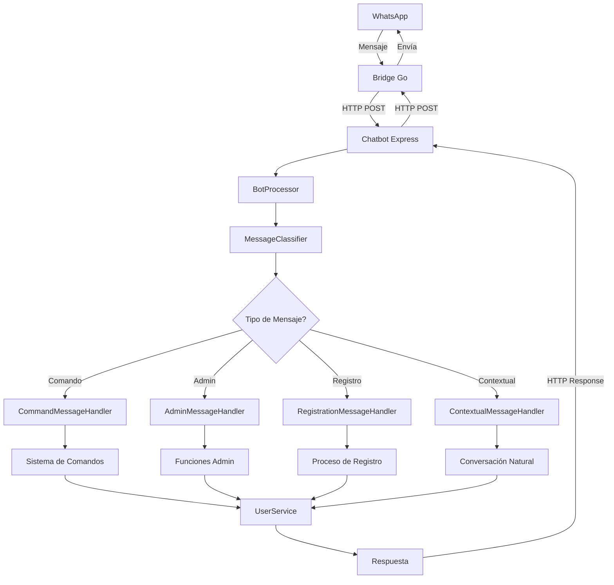

# 🤖 DrasBot WhatsApp - Ecosistema Completo


## 📋 Descripción General

DrasBot es un ecosistema completo de WhatsApp chatbot diseñado con arquitectura moderna y modular. El proyecto consta de dos componentes principales que trabajan en conjunto para proporcionar una solución robusta de automatización de WhatsApp.

### 🏗️ Arquitectura del Ecosistema

```
┌─────────────────────────────────────────────────────────────┐
│                    🤖 DrasBot Ecosystem                     │
├─────────────────────────────────────────────────────────────┤
│                                                             │
│  ┌─────────────────┐         ┌─────────────────────────┐   │
│  │  WhatsApp Bridge │◄──────►│   WhatsApp Chatbot      │   │
│  │     (Go)         │   API   │    (Node.js/TypeScript) │   │
│  │                  │  REST   │                         │   │
│  │  • Port: 8080    │         │  • Port: 3000           │   │
│  │  • Go 1.21+      │         │  • Node.js 18+          │   │
│  │  • whatsmeow     │         │  • Express.js           │   │
│  │  • SQLite        │         │  • SQLite               │   │
│  └─────────────────┘         └─────────────────────────┘   │
│           │                            │                    │
│           │                            │                    │
│      ┌─────▼────────┐              ┌───▼─────────────┐     │
│      │   WhatsApp   │              │  Sistema de     │     │
│      │   Protocol   │              │   Comandos      │     │
│      └──────────────┘              └─────────────────┘     │
└─────────────────────────────────────────────────────────────┘
```

## 🚀 Componentes del Ecosistema

### 1. 🌉 WhatsApp Bridge (Go)
**Ubicación**: `/whatsapp-bridge/`

Servidor de conexión directo con WhatsApp que maneja la comunicación a nivel de protocolo.

#### Características Principales:
- **Lenguaje**: Go 1.21+
- **Puerto**: 8080 (solo localhost)
- **Base de datos**: SQLite (mensajes y sesiones)
- **Biblioteca**: `go.mau.fi/whatsmeow`
- **Funcionalidades**:
  - Conexión directa con WhatsApp Web
  - Manejo de autenticación QR
  - Envío y recepción de mensajes
  - Gestión de medios (imágenes, audio, documentos)
  - API REST para comunicación con el chatbot

#### Archivos Clave:
```
whatsapp-bridge/
├── main.go                 # Punto de entrada principal
├── go.mod                  # Dependencias de Go
├── store/
│   ├── whatsapp.db        # Base de datos de sesión
│   └── messages.db        # Historial de mensajes
└── backup-*/              # Backups automáticos
```

### 2. 🤖 WhatsApp Chatbot (Node.js/TypeScript)
**Ubicación**: `/whatsapp-chatbot/`

Sistema inteligente de procesamiento de mensajes con arquitectura modular moderna.

#### Características Principales:
- **Lenguaje**: Node.js 18+ / TypeScript 5.8+
- **Puerto**: 3000 (solo localhost)
- **Base de datos**: SQLite (usuarios y configuración)
- **Framework**: Express.js
- **Arquitectura**: Modular con patrones modernos

#### Estructura del Proyecto:
```
whatsapp-chatbot/
├── src/
│   ├── app.js                    # Punto de entrada (legacy)
│   ├── bot/
│   │   ├── commands/             # Sistema de comandos modular
│   │   │   ├── core/            # Núcleo del sistema de comandos
│   │   │   ├── general/         # Comandos públicos
│   │   │   ├── user/            # Comandos de usuario
│   │   │   └── system/          # Comandos administrativos
│   │   ├── handlers/            # Handlers especializados
│   │   │   ├── AdminMessageHandler.ts
│   │   │   ├── CommandMessageHandler.ts
│   │   │   ├── ContextualMessageHandler.ts
│   │   │   └── RegistrationMessageHandler.ts
│   │   └── core/               # Procesadores principales
│   │       ├── botProcessor.ts  # Coordinador principal
│   │       └── messageClassifier.ts # Clasificador de mensajes
│   ├── database/               # Modelos y conexiones
│   ├── services/              # Servicios especializados
│   ├── interfaces/            # Definiciones TypeScript
│   ├── types/                 # Tipos TypeScript
│   ├── utils/                 # Utilidades
│   └── whatsapp/             # Cliente WhatsApp
├── dist/                     # Código compilado TypeScript
├── logs/                     # Archivos de log
├── config/                   # Configuraciones
├── scripts/                  # Scripts de gestión
└── package.json              # Dependencias y scripts
```

## 🏛️ Arquitectura de Software

### 📊 Patrón de Diseño
El chatbot implementa una **arquitectura modular** con los siguientes patrones:

1. **Command Pattern**: Sistema de comandos extensible
2. **Handler Pattern**: Procesadores especializados por tipo de mensaje
3. **Service Layer**: Servicios independientes y reutilizables
4. **Repository Pattern**: Acceso a datos unificado

### 🔄 Flujo de Procesamiento de Mensajes



### 🎯 Sistema de Comandos Modular

#### Jerarquía de Comandos:
- **Nivel 1 (Básicos)**: `/help`, `/info`, `/ping`, `/estado`
- **Nivel 2 (Usuario)**: `/profile`, `/usertype`, `/permissions`
- **Nivel 3 (Sistema)**: `/stats`, `/export`, `/logs`
- **Nivel 4 (Admin)**: `/admin`, `/users`, `/maintenance`, `/broadcast`

#### Tipos de Usuario:
- **admin**: Acceso completo al sistema
- **customer**: Comandos básicos
- **friend**: Comandos de usuario
- **familiar**: Acceso cómodo
- **employee**: Funciones de trabajo
- **provider**: Acceso de proveedor
- **block**: Usuario bloqueado

## 🗄️ Base de Datos

### Bridge Database (`whatsapp.db`)
```sql
-- Gestión de sesiones de WhatsApp
-- Almacenamiento de claves de cifrado
-- Información de dispositivos conectados
```

### Messages Database (`messages.db`)
```sql
-- Historial completo de mensajes
-- Metadatos de conversaciones
-- Archivos multimedia
```

### Chatbot Database (`users.db`)
```sql
-- Tabla: users
  • whatsapp_jid (PRIMARY KEY)
  • phone_number
  • display_name
  • user_type
  • status (active/inactive/pending)
  • created_at, updated_at

-- Tabla: conversation_states
  • user_id
  • chat_jid
  • current_state
  • context_data

-- Tabla: user_interactions
  • user_id
  • interaction_type
  • timestamp
  • metadata

-- Tabla: registration_logs
  • user_id
  • action_type
  • timestamp
  • details
```

## 🛠️ Gestión del Ecosistema

### 📜 Scripts de Gestión

#### Script Principal: `./manage.sh`
```bash
# Gestión completa del ecosistema
./manage.sh setup          # Configuración inicial completa
./manage.sh start           # Iniciar bridge + chatbot
./manage.sh stop            # Detener todo
./manage.sh restart         # Reiniciar todo
./manage.sh status          # Estado completo
./manage.sh logs            # Logs combinados
./manage.sh health          # Chequeo de salud
./manage.sh clean           # Limpiar procesos colgados

# Gestión individual
./manage.sh bridge-start    # Solo bridge
./manage.sh chatbot-start   # Solo chatbot
```

#### Scripts Especializados:
```bash
# Instalación de dependencias
./install-deps.sh           # Instalar todo automáticamente

# Seguridad
./setup-security.sh         # Configurar firewall y permisos
./security-monitor.sh       # Monitor de seguridad

# Monitoreo
./monitor.sh               # Monitor en tiempo real
```

### 🔧 Gestión con PM2

```bash
# Ver estado
pm2 status

# Logs en tiempo real
pm2 logs whatsapp-chatbot

# Reiniciar
pm2 restart whatsapp-chatbot

# Monitor avanzado
pm2 monit
```

### 🔍 Gestión con Tmux (Desarrollo)

```bash
# Bridge en tmux
cd whatsapp-bridge
tmux new-session -d -s whatsapp-bridge "go run main.go"

# Conectar a sesión
tmux attach -t whatsapp-bridge

# Ver sesiones
tmux list-sessions
```

## 🔐 Seguridad

### 🛡️ Medidas de Seguridad Implementadas

1. **Acceso Local Únicamente**:
   - Bridge: `127.0.0.1:8080`
   - Chatbot: `127.0.0.1:3000`

2. **Firewall (UFW)**:
   ```bash
   # Solo puertos específicos abiertos
   ufw allow 22/tcp       # SSH
   ufw deny 3000/tcp      # Chatbot (solo local)
   ufw deny 8080/tcp      # Bridge (solo local)
   ```

3. **Permisos de Archivos**:
   - Bases de datos: `600` (solo propietario)
   - Logs: `750` (propietario y grupo)
   - Scripts: `750` (ejecutables)

4. **Variables de Entorno**:
   - Claves API seguras
   - Configuración sensible en `.env`

## 📦 Instalación

### 🎯 Instalación Rápida (Recomendada)

```bash
# Clonar el repositorio
git clone [tu-repo] drasBot
cd drasBot

# Instalación automática
./install-deps.sh

# Configuración inicial
./manage.sh setup

# Iniciar el ecosistema
./manage.sh start
```

### 🔧 Instalación Manual

#### Dependencias del Sistema:
```bash
# Manjaro/Arch
sudo pacman -S nodejs npm go tmux

# Debian/Ubuntu
sudo apt update && sudo apt install -y nodejs npm golang tmux
```

#### Dependencias del Proyecto:
```bash
# Instalar PM2 globalmente
npm install -g pm2

# Dependencias del chatbot
cd whatsapp-chatbot
npm install

# Dependencias del bridge
cd ../whatsapp-bridge
go mod tidy
go mod download
```

## 🚀 Uso y Operación

### 📱 Comandos Disponibles

#### Comandos Básicos:
- `/help` - Ayuda personalizada por tipo de usuario
- `/info` - Información del bot y sistema
- `/ping` - Verificar latencia del bot
- `/estado` - Estado actual del sistema

#### Comandos de Usuario:
- `/profile` - Ver perfil y estadísticas personales
- `/usertype [tipo]` - Ver o cambiar tipo de usuario
- `/permissions` - Ver permisos y restricciones

#### Comandos Administrativos:
- `/admin` - Panel de administración principal
- `/users list [límite] [página]` - Gestión de usuarios
- `/users search <término>` - Búsqueda de usuarios
- `/users update <tel> type <tipo>` - Cambiar tipo de usuario
- `/stats [tipo]` - Estadísticas del sistema
- `/logs [tipo] [líneas]` - Ver logs del sistema
- `/maintenance [on|off]` - Modo mantenimiento

### 📊 Monitoreo y Logs

#### Ubicaciones de Logs:
```
logs/
├── combined.log           # Logs combinados
├── out.log               # Stdout de PM2
├── error.log             # Errores de PM2
├── chatbot.log           # Logs específicos del bot
└── bridge.log            # Logs del bridge
```

#### Comandos de Monitoreo:
```bash
# Monitor en tiempo real
./monitor.sh

# Logs específicos
tail -f logs/chatbot.log
tail -f logs/bridge.log

# Estado del sistema
./manage.sh health
```

## 🧪 Testing y Desarrollo

### 🔬 Scripts de Testing

```bash
# Testing de comandos
node test-commands.js

# Testing de usuarios
node test-users.js

# Testing del sistema de registro
node test-registration-system.js

# Validación de migración
node scripts/validate-migration.js
```

### 🐛 Debugging

```bash
# Modo debug
NODE_ENV=development npm run dev

# Logs detallados
LOG_LEVEL=debug npm start

# Debug específico de comandos
DEBUG_COMMANDS=true npm start
```

## 📈 Estadísticas y Métricas

### 📊 Métricas del Sistema

El sistema proporciona estadísticas completas:

- **Usuarios Registrados**: Total y por tipo
- **Mensajes Procesados**: Contadores en tiempo real  
- **Comandos Ejecutados**: Frecuencia y uso
- **Rendimiento**: Memoria, CPU, latencia
- **Actividad**: Usuarios activos en diferentes períodos

### 🎯 Indicadores de Rendimiento

- **Latencia promedio**: < 100ms para comandos básicos
- **Memoria**: < 300MB en operación normal
- **Uptime**: 99.9% con reinicio automático
- **Throughput**: 1000+ mensajes/hora

## 🔄 Migración y Evolución

### 🎭 Sistema Dual Legacy/Moderno

El proyecto implementa un sistema de migración gradual:

1. **Sistema Legacy**: Código original en JavaScript
2. **Sistema Moderno**: Nueva arquitectura TypeScript
3. **Coexistencia**: Ambos sistemas funcionan en paralelo
4. **Migración Gradual**: Transferencia comando por comando

### 📋 Estado de Migración

#### ✅ Completado:
- [x] Comandos básicos (`/help`, `/info`, `/ping`)
- [x] Sistema de usuarios (`/profile`, `/usertype`)  
- [x] Comandos administrativos (`/users`, `/admin`)
- [x] Sistema de permisos
- [x] Base de datos moderna
- [x] Arquitectura TypeScript

#### 🔄 En Proceso:
- [ ] Comandos de sistema (`/stats`, `/logs`)
- [ ] Sistema de mantenimiento
- [ ] Comandos contextuales avanzados
- [ ] Métricas en tiempo real

#### 📋 Planificado:
- [ ] API REST completa
- [ ] Sistema de plugins
- [ ] Interfaz web de administración
- [ ] Integración con otros servicios

## 🤝 Contribución

### 📝 Estructura para Nuevos Comandos

```typescript
// src/bot/commands/[categoria]/NuevoComando.ts
import { Command } from "../core/Command";
import { CommandContext, CommandResult } from "../../types";

export class NuevoComando extends Command {
  get metadata() {
    return {
      name: "nuevo",
      description: "Descripción del comando",
      category: "general",
      permissions: ["user"],
      cooldown: 5000,
      syntax: "/nuevo [parámetros]"
    };
  }

  async execute(context: CommandContext): Promise<CommandResult> {
    // Implementación del comando
    return {
      success: true,
      response: "Respuesta del comando"
    };
  }
}
```

### 🔧 Añadir Nuevos Servicios

```typescript
// src/services/NuevoService.ts
export class NuevoService {
  constructor(private config: ServiceConfig) {}
  
  async initialize(): Promise<void> {
    // Inicialización del servicio
  }
  
  async metodoPublico(): Promise<any> {
    // Funcionalidad del servicio
  }
}
```

## 📚 Documentación Técnica

### 🔗 Enlaces Importantes

- **Configuración**: `whatsapp-chatbot/.env`
- **PM2 Config**: `whatsapp-chatbot/config/ecosystem.config.js`
- **TypeScript Config**: `whatsapp-chatbot/tsconfig.json`
- **Documentación de Implementación**: `whatsapp-chatbot/IMPLEMENTACION_FINAL_COMPLETA.md`

### 📖 Documentos de Referencia

- [Guía de Instalación](whatsapp-chatbot/INSTALL.md)
- [Sistema de Registro](whatsapp-chatbot/SISTEMA-REGISTRO-NOMBRES.md)
- [Plan de Refactorización](.github/chatmodes/refactor.chatmode.md)

## 🚨 Solución de Problemas

### ❗ Problemas Comunes

#### Bridge no se conecta:
```bash
# Verificar puerto
netstat -tulpn | grep 8080

# Reiniciar bridge
./manage.sh bridge-restart

# Ver logs
tail -f logs/bridge.log
```

#### Chatbot no responde:
```bash
# Verificar PM2
pm2 status

# Reiniciar chatbot  
./manage.sh chatbot-restart

# Verificar logs
pm2 logs whatsapp-chatbot
```

#### Problemas de permisos:
```bash
# Reconfigurar permisos
./setup-security.sh

# Verificar base de datos
ls -la src/database/
```

### 🔧 Comandos de Diagnóstico

```bash
# Salud completa del sistema
./manage.sh health

# Monitor de seguridad
./security-monitor.sh

# Reset completo
./manage.sh reset
```

## 📄 Licencia

Este proyecto está bajo la Licencia MIT. Ver el archivo `LICENSE` para más detalles.

## 👥 Autor y Desarrollo

**🧑‍💻 Desarrollador Principal**: Daniel Martinez Sebastian

Proyecto desarrollado completamente por Daniel Martinez Sebastian como solución integral de automatización WhatsApp con arquitectura moderna y escalable.

### 📧 Contacto

- **Desarrollador**: Daniel Martinez Sebastian
- **Proyecto**: DrasBot WhatsApp Ecosystem
- **Licencia**: MIT

---

**🎉 ¡Gracias por usar DrasBot WhatsApp Ecosystem!**

Para soporte técnico o contribuciones, consulta la documentación técnica.
