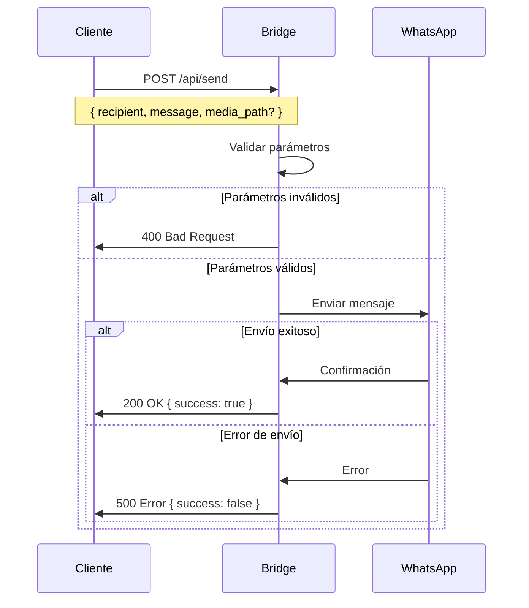
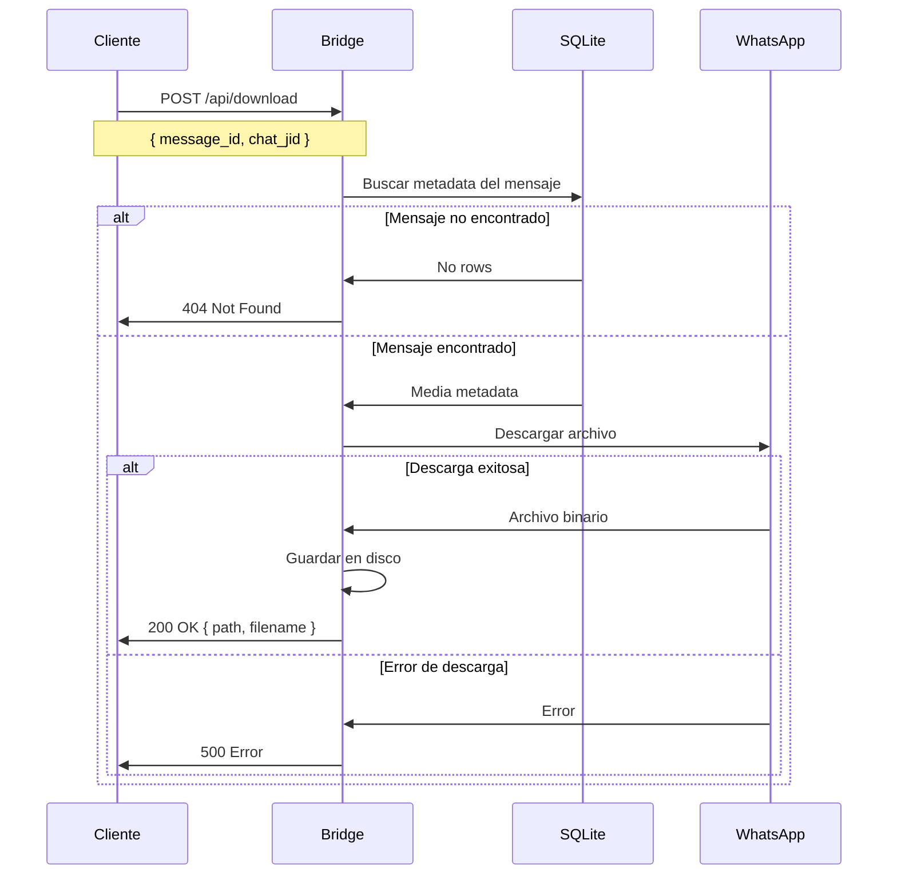
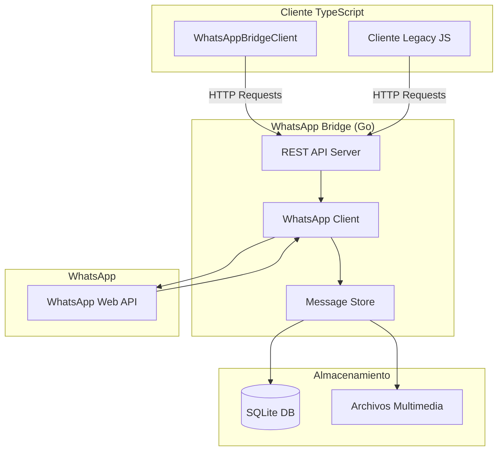
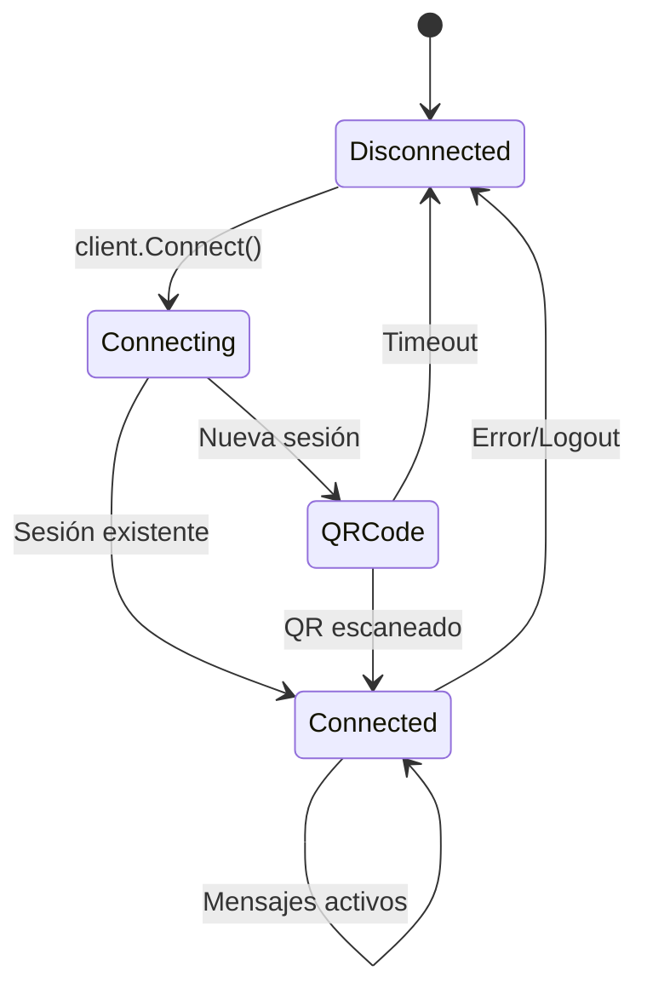

# Diagramas de Flujo del WhatsApp Bridge

## Flujo de Envío de Mensajes

```mermaid
sequenceDiagram
    participant C as Cliente
    participant B as Bridge
    participant W as WhatsApp

    C->>B: POST /api/send
    Note over C,B: { recipient, message, media_path? }
    
    B->>B: Validar parámetros
    alt Parámetros inválidos
        B->>C: 400 Bad Request
    else Parámetros válidos
        B->>W: Enviar mensaje
        alt Envío exitoso
            W->>B: Confirmación
            B->>C: 200 OK { success: true }
        else Error de envío
            W->>B: Error
            B->>C: 500 Error { success: false }
        end
    end
```

## Flujo de Descarga de Multimedia

```mermaid
sequenceDiagram
    participant C as Cliente
    participant B as Bridge
    participant DB as SQLite
    participant W as WhatsApp

    C->>B: POST /api/download
    Note over C,B: { message_id, chat_jid }
    
    B->>DB: Buscar metadata del mensaje
    alt Mensaje no encontrado
        DB->>B: No rows
        B->>C: 404 Not Found
    else Mensaje encontrado
        DB->>B: Media metadata
        B->>W: Descargar archivo
        alt Descarga exitosa
            W->>B: Archivo binario
            B->>B: Guardar en disco
            B->>C: 200 OK { path, filename }
        else Error de descarga
            W->>B: Error
            B->>C: 500 Error
        end
    end
```

## Arquitectura del Sistema

```mermaid
graph TB
    subgraph "Cliente TypeScript"
        CTS[WhatsAppBridgeClient]
        CJS[Cliente Legacy JS]
    end
    
    subgraph "WhatsApp Bridge (Go)"
        API[REST API Server]
        WC[WhatsApp Client]
        MS[Message Store]
    end
    
    subgraph "Almacenamiento"
        DB[(SQLite DB)]
        FILES[Archivos Multimedia]
    end
    
    subgraph "WhatsApp"
        WA[WhatsApp Web API]
    end
    
    CTS -->|HTTP Requests| API
    CJS -->|HTTP Requests| API
    API --> WC
    WC --> WA
    WC --> MS
    MS --> DB
    MS --> FILES
    WA --> WC
```

## Estados de Conexión

```mermaid
stateDiagram-v2
    [*] --> Disconnected
    Disconnected --> Connecting: client.Connect()
    Connecting --> QRCode: Nueva sesión
    Connecting --> Connected: Sesión existente
    QRCode --> Connected: QR escaneado
    QRCode --> Disconnected: Timeout
    Connected --> Disconnected: Error/Logout
    Connected --> Connected: Mensajes activos
```
